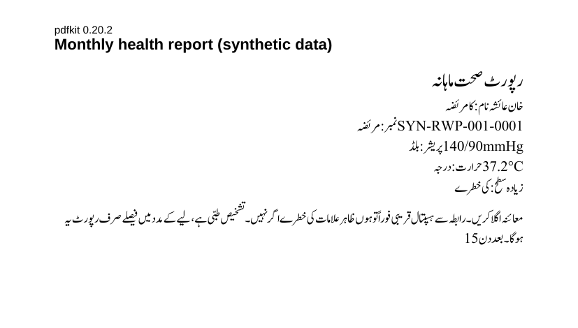
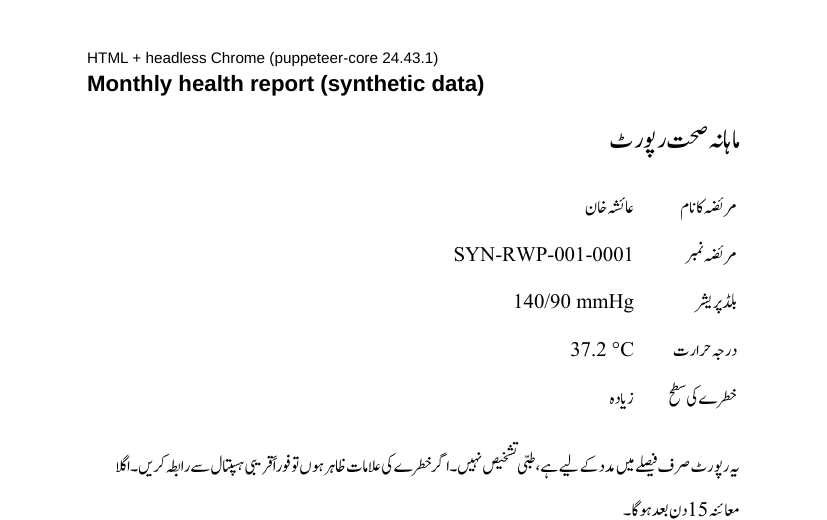

# 0003. Urdu text in PDF reports

- **Status:** Proposed
- **Date:** 2026-10-03
- **Scope:** M7 FE-3 (bilingual progress report with an Urdu summary), M10 FE-2 (weekly and monthly PDF reports); Tools table: "pdfkit + ExcelJS"
- **Roadmap:** Risks and decisions, row 3: "Test a one-page Urdu PDF in Phase 0; if it breaks, render the report as HTML with the Urdu font and print it to PDF with headless Chrome (Puppeteer)"

## The test

[`experiments/urdu-pdf/`](experiments/urdu-pdf/) prints the same one-page report two ways, both with the Jameel Noori Nastaleeq font the app uses:

- with pdfkit 0.20.2;
- as HTML printed to PDF by headless Chrome through puppeteer-core 24.43.1.

The page holds an Urdu title, five label–value lines that mix Urdu with an ID, numbers and units (`SYN-RWP-001-0001`, `140/90 mmHg`, `37.2 °C`), and an Urdu paragraph. All values are made up (LI-10).

| pdfkit 0.20.2 | HTML + headless Chrome |
|---|---|
|  |  |

## Results

| Check | pdfkit | HTML + Chrome |
|---|---|---|
| Letters join into Nastaliq word shapes | Yes | Yes |
| Words run right to left | **No**: each line runs left to right, so every Urdu sentence reads backwards | Yes |
| Numbers, IDs and units inside Urdu lines | **Broken**: runs move to the wrong side, and spaces are lost (`140/90mmHg`, `37.2°C`) | Correct, kept left to right |
| Right alignment and line wrapping of the Urdu paragraph | Aligned right, but the words in each line are in the wrong order | Correct |
| Text layer (copy, search) | Broken words | Usable |

**How this was measured.** The word positions come from the PDF text layer (`pdftotext -bbox`). Nastaliq is hard to judge by eye, so the positions were checked as well as the images:

- In Chrome's output the first word of each line (مریضہ) sits right of the words that follow it, which is correct.
- In pdfkit's output it sits at the left end of the line.
- pdfkit has no right-to-left or bidirectional-text support, so this is a limitation of the library, not a setting.

## Options

1. **pdfkit with a manual workaround.** Reorder each line with a bidi library, lay out each word separately and write right-to-left line wrapping by hand. *Rejected:* it needs a new library anyway, it is fragile, and it would be a large piece of code to maintain.
2. **Urdu as pictures inside pdfkit.** *Rejected:* it loses selectable text, enlarges files and needs another renderer anyway.
3. **HTML + headless Chrome (the roadmap's fallback).** The browser handles shaping, bidi and wrapping, and reports become HTML templates.

## Proposed decision

**Option 3, for every PDF report** (M7 FE-3 and M10 FE-2), so the API has one PDF method. ExcelJS stays for Excel reports.

- Use `puppeteer-core` with a Chrome or Chromium that is already installed, found through a `CHROME_PATH` setting in `api/.env`. Do not use `puppeteer`, which downloads its own browser on every `npm install`.
  - Windows development uses the installed Google Chrome.
  - The staging server installs Chromium.
  - GitHub's Ubuntu runners already include Chrome, so CI can test reports.
- Load the font from the repository's `JameelNooriNastaleeq.ttf`, so reports look the same as the app.
- Put Latin-script values (IDs, numbers with units) in `<bdi>` elements, as in the experiment.
- Render reports one at a time from the `report_jobs` queue. Chrome uses far more memory than pdfkit.

## Consequences

- The scope's Tools table names pdfkit. This replaces it for PDFs, which needs the supervisor's agreement. The report should explain the change with the images above.
- The API gains a dependency on an installed browser. Document it in `api/CLAUDE.md` and in the staging setup.
- `npm audit` reports high-severity advisories in `basic-ftp` and `extract-zip`. They come through puppeteer-core's browser-download helper, which this setup does not use, but check the advisories again before adopting the package.
- Confirm that the font's licence allows embedding it in generated PDFs. It is already bundled in the app.

## Sign-off

| Name | Role | Decision | Date |
|---|---|---|---|
| Muhammad Zain Abbas | Team (M10 reports owner) | | |
| Zain Ali | Team (M7 report owner) | | |
| Ma'am Sajida Kalsoom | Supervisor (Tools table change) | | |
