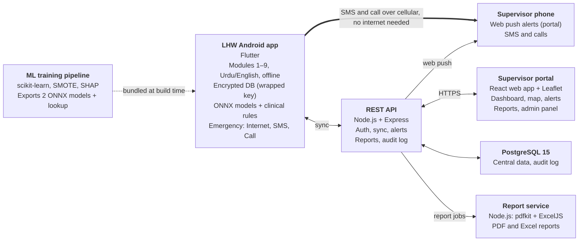

# MediQore Full-Stack Implementation Roadmap

> Markdown copy of [`roadmap.pdf`](roadmap.pdf) (Oct 10, 2026), made so the roadmap can be searched and read inside the repo. The text and tables are copied unchanged; the architecture diagram is redrawn as a Mermaid chart. If this copy and the PDF ever differ, the PDF wins.
>
> This version replaces the earlier roadmap (Oct 2, 2026) and its amendment A1, which the updated scope now includes.

Oct 10, 2026 · @Mehdi

## Overview

MediQore follows the schedule in the final scope (Table 5 and the Gantt chart): Design and foundation from 2 Nov to 27 Dec 2026, three development phases totalling 16 weeks from 4 Jan to 25 Apr 2027, testing until 20 Jun, and final submission by 18 Jul 2027. Analysis (7 Sep – 1 Nov 2026) is complete. Module 10 grows in every phase, so the supervisor portal always shows what the mobile app can already collect.

Every task is tagged with its ID in the updated final scope (for example M5 FE-2 = Module 5, FE-2). Any clinical rule a task uses comes from the versioned Clinical Rules Table, which the Clinical Advisor must sign before real patients are involved (M4 FE-4, LI-12).

| Phase | Modules | Dates (weeks) | Lead (support) | Exit gate |
|---|---|---|---|---|
| 0. Design and foundation | Figma, schema, API and auth skeleton, sync skeleton, Clinical Rules Table v0 | 2 Nov – 27 Dec 2026 (8) | Shared | One record created offline on the phone appears on the portal |
| 1. Core field workflow | M1, M2, M3, M10 base | 4 Jan – 7 Feb 2027 (5) | Zain Abbas (Zain Ali: M10 support, API, sync) | LHW activates once, unlocks offline with her PIN, registers a woman and records a visit with the danger-sign checklist; it syncs and shows on the dashboard with her last-sync time |
| 2. Intelligence and emergency | M4, M5, M6, M10 update | 8 Feb – 21 Mar 2027 (6) | Zain Abbas: M4, M10. Zain Ali: M5, M6 | A visit gets a risk result from the five- or six-feature model plus the danger-sign rules; an emergency reaches the supervisor by web push, SMS and call |
| 3. Child health and campaigns | M7, M8 (incl. child register), M9, M10 final | 22 Mar – 25 Apr 2027 (5) | Zain Ali: M7, M8, M9. Zain Abbas: M10 | All ten modules work; dashboard and reports cover every module |
| 4. Testing | Integration, final testing, documentation | 26 Apr – 20 Jun (8) | Shared | Full test pass on a low-spec Android phone; documentation complete |
| 5. Completion | Final submission and presentation | 21 Jun – 18 Jul 2027 (4) | Shared | FYP submitted and presented |

Phase 0 can start before 2 Nov; the dates are the latest it should finish.

Owners follow Table 4 of the scope document. Shared work (REST API, PostgreSQL schema, offline sync, integration testing, Figma, deployment) is split inside each phase as listed in the phase sections.

## Architecture and conventions

The Flutter app owns the whole field workflow and never needs the server to do its job; the server only collects, analyses and reports. Settle the rules below in Phase 0, because changing them after Phase 1 means rewriting synced data.

**The phone works alone; the server only collects, analyses and reports**



*MediQore architecture · 7 components*

The highlighted path is the key design choice: an emergency SMS or call goes straight from the LHW's phone to the supervisor, with no server in between.

| Component | Technology (from scope) | Responsibility |
|---|---|---|
| LHW mobile app | Flutter 3.x, Drift + SQLite3MultipleCiphers, flutter_secure_storage (Android Keystore), onnxruntime, google_mlkit_text_recognition, fl_chart | Modules 1–9 in Urdu and English (switch in Settings), fully offline; on-device AI models, danger-sign rules and vital trends; emergency alerts |
| REST API | Node.js 24 LTS + Express 5, jsonwebtoken, Joi, pdfkit + ExcelJS | Auth and activation codes, sync and conflict detection, alerts and server-side escalation, PDF and Excel reports, audit log |
| Database | PostgreSQL 15 | Central store for all modules, audit log, sync sequence numbers |
| Supervisor and admin portal | React 18 (installable web app), Leaflet.js, Web Push | Module 10: dashboard, map, alerts with web push and acknowledgement, reports, admin panel, PIN-reset reply codes |
| ML training | Python 3.11, scikit-learn, imbalanced-learn, SHAP, skl2onnx | Offline training, validation and ONNX export of the five- and six-feature models |
| Clinical Rules Table | Versioned JSON configuration | Danger signs, BP and Hb levels, obstetric history flags, MUAC, IMCI and EPI timings, read by the app and the server |

Use one GitHub monorepo so the API contract, migrations and app change together:

```
mediqore/
    mobile/           Flutter app (LHW)
    api/              Node.js + Express REST API
    web/              React supervisor and admin portal (installable web app)
    ml/               Python training, SHAP lookup, ONNX export
    clinical-rules/   Versioned Clinical Rules Table (JSON), shared by app and API
    db/               PostgreSQL migrations and synthetic seed scripts
    docs/             OpenAPI contract, ERD, test reports
```

| Area | Rule |
|---|---|
| Record IDs | Every record made on the device gets a UUID v4; the server adds a sequence number when it accepts it. Never order records by device clock (LI-7). |
| Deletes and audit | Soft deletes only. Every create, edit, delete, referral, alert and login writes an audit row with user and timestamp (M10 FE-3). |
| API and login | REST under /api/v1, JSON, Joi validation on every request body, JWT access and refresh tokens over HTTPS only. Offline unlock is local (PIN), never a JWT check (M1 FE-2). |
| Encryption keys | The local database key is a random 256-bit key, stored wrapped by a non-exportable Android Keystore key and unwrapped in memory only when the database opens; never derived from the password or PIN (M3 FE-2, LI-8). |
| Units | One unit per value: BP in mmHg, pulse in bpm, temperature in °C, blood sugar in mmol/L, Hb in g/dL, weight in kg, MUAC in mm. Convert only at the model input or display layer. |
| Clinical rules | Every clinical rule lives in the versioned Clinical Rules Table, never in code; defaults are marked "pending clinical review" until the Clinical Advisor signs the table (M4 FE-4, LI-12). Store the rules version on every result. |
| Languages | All labels in Flutter ARB files with Urdu and English entries; Settings → Language switches the whole app at runtime and the choice is saved (M3 FE-3). Urdu renders right to left in Jameel Noori Nastaleeq, English left to right; numbers always stay left to right. |
| Git workflow | main is always demo-ready; feature branches per FE (for example feature/m3-fe1-visit-form); every merge reviewed by the other member; GitHub Actions runs lint and tests. |
| Environments | Local PostgreSQL for development; one HTTPS staging server for supervisor reviews and demos (needed for web push). |

## Phase 0: Design and foundation (2 Nov – 27 Dec 2026)

Phase 0 is the scope's Design phase: Figma screens (4 weeks) and database schema plus API setup (4 weeks), with the project skeleton every module plugs into. Design the database for all ten modules now, even though most tables stay empty until later phases.

| ID | Task | Scope link | Owner |
|---|---|---|---|
| P0-1 | Create the monorepo, branch protection on main, and a GitHub Actions workflow that runs lint and unit tests | Tools: Git + GitHub | Shared |
| P0-2 | Flutter project: Urdu and English ARB localisation with a runtime language switch, bundled Jameel Noori Nastaleeq font, RTL theme for Urdu and LTR for English, and a small widget kit (large buttons, form fields, Green/Yellow/Red risk chips, offline status bar with unsynced count) | M3 FE-1, FE-3 | Zain Abbas |
| P0-3 | Express 5 API skeleton on Node.js 24 LTS: routes, controllers, services, Joi validation middleware, central error handler, request logging, OpenAPI file | M1 FE-2, Tools | Zain Ali |
| P0-4 | PostgreSQL schema v1 with migrations for all core entities (see Data model), including activation codes, Clinical Rules Table versions, pregnancy outcomes and the child register | Shared: DB schema | Zain Ali |
| P0-5 | React portal skeleton set up as an installable web app: routing, login page, auth guard, layout with sidebar, empty Leaflet map component, service worker ready for web push | M10, M5 FE-2 | Zain Ali |
| P0-6 | Offline sync skeleton: device outbox table, POST /sync/push and GET /sync/pull?since=, one record proven end to end | M3 FE-2 | Shared |
| P0-7 | Figma screens for Phase 1: activation and PIN unlock, LHW home, registration, visit form with danger-sign checklist, Settings with the language switch, dashboard home, admin lists | Mockups 1, 2, 6 | Shared |
| P0-8 | Synthetic data generator: districts, Union Councils, LHWs, households with GPS, pregnant women, visits | LI-10 | Zain Ali |
| P0-9 | Draft and submit the IEC application (due in Semester 7) | LI-10 | Shared |
| P0-10 | Start the ML track: download the UCI dataset, exploratory notebook, check duplicates and class balance, note that the data is from rural Bangladesh | M4 FE-1, LI-2 | Zain Abbas |
| P0-11 | Clinical Rules Table v0 with WHO-referenced defaults marked "pending clinical review", and approach a Clinical Advisor | M4 FE-4, LI-12, Stakeholders | Shared |
| P0-12 | Remaining technical check: Urdu text in a pdfkit PDF (fall back to HTML-to-PDF if it breaks) | M6 FE-3 | Shared |

### Exit gate for Phase 0

- One test record created on the phone offline, synced, stored in PostgreSQL and visible on the React portal
- CI runs on every pull request
- Schema v1 and OpenAPI v1 reviewed by both members
- IEC application submitted

## Phase 1: Core field workflow — M1, M2, M3, M10 base (4 Jan – 7 Feb 2027)

By the end of Phase 1 an LHW can activate her phone once, unlock it offline with her PIN, register a pregnant woman and record a visit with no internet, and the supervisor sees it on the portal after sync. Zain Abbas builds the mobile modules and leads Module 10; Zain Ali supports Module 10 and builds the API and sync engine, because his own modules start in Phase 2.

### Module 1: LHW onboarding and access control

| Task | Layer | Scope link | Owner |
|---|---|---|---|
| Admin creates an LHW with district, Union Council and area; system issues a unique LHW ID and credentials | API + Web | FE-1 | Zain Ali |
| Her assigned-area patient list syncs at first login (it may be empty) | Mobile + API | FE-1 | Shared |
| Admin generates a one-time activation code: random, about 8 characters, valid 48 hours, usable once, stored hashed | API + Web | FE-2 | Zain Ali |
| First login on a device (online): username, password and activation code; JWT access and refresh tokens over HTTPS; login rate limiting | Mobile + API | FE-2 | Shared |
| Random 256-bit database key generated on the phone and stored wrapped by a separate, non-exportable Android Keystore key (flutter_secure_storage); unwrapped in memory when the database opens and passed to SQLite3MultipleCiphers; never derived from password or PIN | Mobile | FE-2, LI-8 | Zain Abbas |
| Offline unlock with a 6-digit PIN checked against a slow hash; progressive delays of 30 s, 1 min, 5 min and 15 min, never a lockout that needs internet | Mobile | FE-2 | Zain Abbas |
| Offline PIN reset: the phone shows a short code, the supervisor enters it in the portal and reads back a reply code, which the phone checks with the secret received at activation | Mobile + Web + API | FE-2 | Shared |
| Lock screen "Emergency call supervisor" button | Mobile | FE-2 | Zain Abbas |
| Local auto-lock after inactivity, separate from server token expiry; tokens refresh at each sync; deactivation takes effect at the next connection | Mobile + API | FE-2, FE-3, LI-8 | Shared |
| Admin area reassignment, activation and deactivation, password reset (no local data loss, because the key is not password-based) | Web + API | FE-3, LI-8 | Zain Ali |

### Module 2: Pregnant woman registration

| Task | Layer | Scope link | Owner |
|---|---|---|---|
| Registration form (name, age, husband's name, contact, address, pregnancy month, village) in Urdu with validation | Mobile | FE-1 | Zain Abbas |
| Patient ID that is unique offline: LHW code plus a local counter, alongside the record UUID | Mobile | FE-1 | Zain Abbas |
| Create the pregnancy file (one woman can have several pregnancies over time) | Mobile + DB | FE-1 | Zain Abbas |
| Obstetric history: previous pregnancies, C-sections, stillbirths, known conditions | Mobile | FE-2 | Zain Abbas |
| Obstetric risk-factor flags (for example "Previous C-section") shown on the profile and result screen; they never change the risk colour unless the signed Clinical Rules Table says so | Mobile | FE-2 | Zain Abbas |
| Household entity with GPS capture (geolocator package), linked to the woman; reused later by the child register, polio and nutrition modules | Mobile + DB | FE-3 | Zain Abbas |
| Area-based search, and patients sorted by estimated distance from her current location (no maps needed) | Mobile | FE-3 | Zain Abbas |

### Module 3: Field visit and vitals collection

| Task | Layer | Scope link | Owner |
|---|---|---|---|
| Visit form: BP, pulse, weight, temperature, fetal movement, swelling, bleeding, fever, anaemia signs, urine symptoms, using checkboxes, dropdowns and large controls | Mobile | FE-1 | Zain Abbas |
| Pulse required: read from the BP device, or counted with a 30-second on-screen counter (tap per beat, app doubles the count) | Mobile | FE-1 | Zain Abbas |
| Optional blood sugar stored with value, unit, date and source (glucometer or verified lab report) | Mobile | FE-1, M4 FE-1 | Zain Abbas |
| Yes/no danger-sign checklist with pictures: convulsions or fits, severe headache, blurred vision, severe or upper abdominal pain, fast or difficult breathing, fever with weakness | Mobile | FE-1, M4 FE-4 | Zain Abbas |
| Range checks to catch typing errors (for example systolic BP outside 60–250 asks for confirmation) | Mobile | FE-1 | Zain Abbas |
| Encrypted local database: Drift native database with SQLite3MultipleCiphers, SQLCipher-compatible AES-256 cipher, using the database key unwrapped in memory from its Keystore-wrapped copy (Module 1) | Mobile | FE-2 | Zain Abbas |
| Sync engine: outbox with retry, idempotent push by UUID, server sequence IDs, pull by cursor, background sync when online | Mobile + API | FE-2 | Shared |
| Conflict detection for duplicate offline submissions; conflicted records flagged for supervisor review and kept in the audit log | API | FE-2, LI-7 | Zain Ali |
| Language switch: Settings → Language toggles the whole app between Urdu (right to left) and English (left to right) at runtime; the choice is saved on the device and Urdu is the default | Mobile | FE-3, LI-6 | Zain Abbas |

### Module 10 base: supervisor portal

| Task | Layer | Scope link | Owner |
|---|---|---|---|
| Admin panel: district, tehsil, Union Council and area hierarchy; LHW and supervisor accounts; activation codes; hospitals and referral centres with phone numbers; role permissions | Web + API | FE-3 | Zain Ali |
| Audit log viewer with filters by user, action and date | Web + API | FE-3 | Zain Ali |
| Near-real-time dashboard cards of synchronised data: each LHW's last-sync time, registered patients, visits this week, last login | Web + API | FE-1 | Zain Abbas |
| Leaflet map of registered households from Module 2 GPS, filter by district, Union Council, LHW and time period, auto-refresh every 5 minutes | Web | FE-1 | Zain Abbas |
| PIN-reset reply-code page for supervisors | Web + API | M1 FE-2 | Zain Ali |
| Sync conflict review queue for supervisors | Web + API | M3 FE-2 | Zain Ali |

### ML track (runs alongside Phase 1)

Zain Abbas trains both models in January (scope Gantt row 3.4), so Module 4 starts Phase 2 with two ready ONNX files. Details are in Phase 2 under Module 4.

### Exit gate for Phase 1

- LHW activates once online, then works fully offline: PIN unlock, registration, visit with danger-sign checklist, in both Urdu and English
- Forgotten PIN is reset offline with a supervisor reply code; a password reset loses no local data
- Records sync automatically when online; a duplicate submission is flagged, not overwritten
- Admin manages areas, accounts, activation codes and hospitals; every action appears in the audit log
- Supervisor sees patients, visits, each LHW's last-sync time and the household map
- Unit tests for form validation, sync and auth pass in CI

## Phase 2: Intelligence and emergency — M4, M5, M6, M10 update (8 Feb – 21 Mar 2027)

By the end of Phase 2 every visit produces a risk result with an Urdu explanation, a critical case can reach the supervisor by web push, SMS or call, and each pregnancy has a full record with on-device trends and a recorded outcome. Zain Abbas owns Module 4 and the Module 10 update; Zain Ali owns Modules 5 and 6.

### Module 4: AI-based maternal risk assessment

| Task | Layer | Scope link | Owner |
|---|---|---|---|
| Clean the UCI data: remove duplicate rows, keep a stratified 20% hold-out test set untouched until the end | ML | FE-1 | Zain Abbas |
| imbalanced-learn Pipeline with SMOTE applied inside each training fold only, so synthetic rows never leak into validation | ML | FE-1, BO-2 | Zain Abbas |
| Train two input sets: a default five-feature model (no blood sugar) and a six-feature model; compare Logistic Regression, Random Forest and Gradient Boosting with 5-fold stratified CV; report F1-macro, per-class F1, per-class recall and ROC-AUC for each set separately | ML | FE-1, BO-2 | Zain Abbas |
| Select each model with a target of at least 90% high-risk recall, then best F1-macro; if neither reaches it, report the shortfall | ML | BO-2 | Zain Abbas |
| Write the dataset note: rural Bangladesh data, not equivalent to Pakistan, performance on Pakistani patients unknown until field validation | ML | LI-2 | Zain Abbas |
| Run SHAP on each chosen model, derive feature-threshold rules per class, map each to reviewed Urdu and English phrases, export the JSON lookup | ML | FE-2 | Zain Abbas |
| Export both models with skl2onnx (plain probability output, no ZipMap); parity test that Python and ONNX agree on every test row | ML | FE-1 | Zain Abbas |
| Run inference with onnxruntime after each visit: the six-feature model only when same-visit blood sugar exists (configurable window), otherwise the five-feature model; convert units (UCI body temperature is in °F) | Mobile | FE-1 | Zain Abbas |
| Benchmark inference time on the lowest-spec test phone (target under 1 second) | Mobile | FE-1 | Zain Abbas |
| Result screen: colour-coded risk, Urdu explanation, obstetric and anaemia flags shown separately, decision-support disclaimer | Mobile | FE-2, LI-5 | Zain Abbas |
| Risk trend across visits: store each result, alert the LHW when the level worsens across visits | Mobile | FE-3 | Zain Abbas |
| Danger-sign rules read from the Clinical Rules Table: severe hypertension (≥160/110), raised BP (≥140/90) with severe headache, blurred vision or upper abdominal pain, every checklist sign, vaginal bleeding, absent or markedly reduced fetal movement, severe anaemia signs, and high fever with another danger sign make an Emergency; raised BP alone gives at least Yellow; swelling is a flag only; final level = higher of model and rules; one unit test per rule | Mobile | FE-4, LI-12 | Zain Abbas |
| Store model version, input set and rules version on every risk result | Mobile + DB | FE-4 | Zain Abbas |

### Module 5: Emergency referral coordination

| Task | Layer | Scope link | Owner |
|---|---|---|---|
| One-tap referral pre-filled with patient details, risk factors and the nearest registered referral facility with its saved phone number, found by GPS distance to the cached facility list | Mobile | FE-1 | Zain Ali |
| Emergency screen opens immediately with three equal buttons (Internet, SMS, Call) and Send all, all live at once; each button shows whether it is usable now | Mobile | FE-2, FE-4 | Zain Ali |
| Check bar for typed values ("BP 190/120 — is this correct? Correct / Edit"); editing re-runs the rules and, if the case no longer qualifies, closes the screen with the logged reason "value corrected"; the buttons never wait for it | Mobile | FE-4 | Zain Ali |
| Screen can be minimised to a banner that stays visible; it closes only with a logged reason (referral done, supervisor reached, false alarm with corrected values) shown to the supervisor; nothing is sent until she taps a button | Mobile | FE-4 | Zain Ali |
| Layer 1: alert to the API and web push from the supervisor portal (installable web app), plus a live alerts page | Mobile + API + Web | FE-2 | Zain Ali |
| Layer 2: pre-filled SMS sent from the LHW's phone (another_telephony, SEND_SMS) with sent and delivered callbacks; if permission is denied, url_launcher opens the SMS app pre-filled | Mobile | FE-2, LI-4 | Zain Ali |
| Layer 3: one-tap call to the supervisor and the secondary contact (flutter_phone_direct_caller) | Mobile | FE-2 | Zain Ali |
| Alarm tone with vibration, protocol checklist, per-option status (Sent, Failed, Not available) with retry | Mobile | FE-4 | Zain Ali |
| Save the alert record locally and sync it in the background when internet returns (workmanager); record time-to-escalation | Mobile + API | FE-4 | Zain Ali |
| Acknowledgement from the web portal on desktop or phone; LHW can mark "supervisor reached" after a call or SMS reply | Mobile + Web + API | FE-5 | Zain Ali |
| Escalation ownership: the server owns an alert once the phone has its receipt (server re-sends and escalates to the secondary contact after 15 minutes); before that the phone owns it and prompts one-tap "SMS / Call secondary contact", never sending automatically; a synced phone-owned alert is not escalated again | Mobile + API | FE-5 | Zain Ali |
| Referral outcome: attended or not, and outcome, visible to the supervisor | Mobile + Web | FE-3 | Zain Ali |

### Module 6: Pregnancy journey, health records and ANC monitoring

| Task | Layer | Scope link | Owner |
|---|---|---|---|
| ANC schedule generated from gestational age at registration (WHO 2016); local reminders (flutter_local_notifications); missed visits flagged | Mobile | FE-1 | Zain Ali |
| TT dose schedule plus iron and folic acid tracking, with a supplement compliance score on the patient profile | Mobile | FE-1 | Zain Ali |
| Report scan: camera or gallery, grayscale and contrast preprocessing, ML Kit text recognition fully offline (Latin-script reports; Urdu and handwritten reports use manual entry) | Mobile | FE-2, LI-9 | Zain Ali |
| Dart regex engine extracting BP, haemoglobin, blood glucose, temperature, weight and urine protein; high-confidence values pre-filled, others confirmed; manual entry fallback | Mobile | FE-2, LI-9 | Zain Ali |
| Anaemia flag from verified Hb values with value, unit, date and source; colour mapping only from the signed Clinical Rules Table | Mobile | FE-2 | Zain Ali |
| Store the original report image (compressed, encrypted on device, uploaded on sync) | Mobile + API | FE-2 | Zain Ali |
| On-device trends in Dart: linear slope per vital, flag a vital rising across the last three visits that has reached or is near its approved threshold (no Z-scores) | Mobile | FE-3 | Zain Ali |
| Offline progress summary on the phone with fl_chart trend graphs, visit history and ANC compliance | Mobile | FE-3 | Zain Ali |
| Bilingual PDF progress report generated on the server after sync (needs connectivity); the LHW exports it to share with the patient or referral facility | API | FE-3 | Zain Ali |
| Pregnancy outcome recording: date, place, live birth (one child record per baby, sex and birth weight; twins give two), stillbirth or miscarriage (no child record), maternal death (flag for review), moved out or lost to follow-up | Mobile + DB | FE-4 | Zain Ali |

### Module 10 update

| Task | Layer | Scope link | Owner |
|---|---|---|---|
| Risk distribution chart (Green, Yellow, Red) and high-risk cluster layer on the map | Web + API | FE-1 | Zain Abbas |
| Referral completion rate, overdue follow-ups and missed ANC visits per LHW | Web + API | FE-1 | Zain Abbas |
| Web push for emergency alerts (service worker, FCM for web) and a phone-friendly alerts page: channel used, time-to-escalation, acknowledge button, unacknowledged alerts highlighted | Web + API | FE-1, M5 FE-2, FE-5 | Zain Abbas |
| Admin: emergency escalation contacts per area (supervisor and secondary contact) | Web + API | FE-3 | Zain Abbas |
| Weekly and monthly PDF and Excel reports: maternal summary, high-risk list, referral completion, LHW activity, emergency alerts; downloaded by authorised supervisors for manual submission | API + Web | FE-2 | Zain Abbas |
| Inactivity detection by visit date: a week is judged only after the LHW synced past it; flag when more than 2 SD below her mean and at least 3 visits lower, after 6 weeks of history (both configurable); leave and campaign weeks excluded; statuses Active, Unusual inactivity, Not enough synced data | API + Web | FE-4 | Zain Abbas |

### Exit gate for Phase 2

- Both models are validated and reported separately; ONNX parity tests pass; any shortfall against the 90% recall target is documented
- Every danger-sign rule forces an Emergency result in tests, even when the model says low risk
- Emergency alert sent by each of the three options: SMS and call in airplane mode with a SIM, web push online
- A typed-value typo is corrected from the check bar without delaying the alert buttons
- Escalation follows the ownership rule in both cases (server receipt received or not)
- OCR pre-fills values from a printed report; a handwritten or Urdu report falls back to manual entry
- A live birth outcome creates a child record; a stillbirth does not
- Dashboard shows risk, referrals, alerts and reports for maternal data

## Phase 3: Child health and campaigns — M7, M8, M9, M10 final (22 Mar – 25 Apr 2027)

By the end of Phase 3 all ten modules work and the portal reports on every one of them. Start with the child register in Module 8 FE-1 in the first week, because Modules 7, 8 and 9 all depend on it.

### Child register — Module 8 FE-1 (first week)

| Task | Layer | Scope link | Owner |
|---|---|---|---|
| Child record for every child under 5 in the area: name, date of birth, sex, caregiver, household (reusing household GPS from Module 2) | Mobile + DB | M8 FE-1 | Zain Ali |
| Household roster for every household in the area, not only those with a pregnant woman | Mobile + DB | M8 FE-1, M7 FE-1 | Zain Ali |
| Newborn records created from Module 6 live-birth outcomes appear in the register automatically | Mobile | M6 FE-4, M8 FE-1 | Zain Ali |
| Deceased status stops a child's schedules and alerts | Mobile + API | M6 FE-4 | Zain Ali |
| Child list per household with age in months, used by Modules 7, 8 and 9 | Mobile | M7–M9 | Zain Ali |

### Module 7: Polio campaign field operations

| Task | Layer | Scope link | Owner |
|---|---|---|---|
| Campaign rounds (name, dates, area) created on the portal and pulled to devices | Web + API + Mobile | FE-1 | Zain Ali |
| House-to-house screen lists the household's registered children under 5; she ticks each child vaccinated this round (OPV, campaign date); household totals calculated automatically; saved offline | Mobile | FE-1 | Zain Ali |
| "New child found" button adds visiting children and unregistered newborns | Mobile | FE-1 | Zain Ali |
| Household status: all vaccinated, refusal (religious concern, misinformation, past reaction) or a separate "Not available" status; both schedule a revisit in the same round | Mobile | FE-2 | Zain Ali |
| Revisit list for the LHW, sorted by distance from her current location | Mobile | FE-2 | Zain Ali |
| "No OPV dose recorded" check across campaign records and routine OPV from Module 8; priority list on the device for her area and on the server for the district | Mobile + API | FE-3 | Zain Ali |

### Module 8: Child immunisation and EPI management

| Task | Layer | Scope link | Owner |
|---|---|---|---|
| EPI schedule config verified against the Federal Directorate of Immunization schedule: BCG, Hep B-0, OPV-0 to OPV-3, Penta 1–3, PCV 1–3, Rota 1–2, IPV-I and IPV-II, MR 1–2 and TCV (National Immunization Policy 2022), with doses whose rollout varies by area (such as the Hep B birth dose) switched on per area; for each dose the dose number, minimum age, recommended age, minimum interval, maximum age where applicable, schedule version and effective date | Config | FE-1 | Zain Ali |
| Personal vaccination timeline per child under 2; dose recording; routine OPV kept separate from campaign doses; each record stores its schedule version | Mobile | FE-1 | Zain Ali |
| Catch-up due dates: next dose due from the previous dose date plus the minimum interval, not only from date of birth | Mobile | FE-1 | Zain Ali |
| Defaulter alert on the LHW home screen when a dose passes its due date; supervisor notified after sync | Mobile + API | FE-2 | Zain Ali |
| WHO zero-dose indicator: no recorded Penta-1 after its due age | Mobile + API | FE-2 | Zain Ali |
| Coverage per antigen and per sub-area, with low-coverage sub-areas highlighted | API + Web | FE-3 | Zain Ali |

### Module 9: Child nutrition and growth screening

| Task | Layer | Scope link | Owner |
|---|---|---|---|
| MUAC entry for ages 6–59 months with WHO classification: below 115 mm SAM, 115 to under 125 mm MAM, 125 mm or above Normal; colour-coded Urdu result | Mobile | FE-1 | Zain Ali |
| Bilateral pitting oedema check: SAM regardless of MUAC | Mobile | FE-1 | Zain Ali |
| Weight-for-age (underweight) and height-for-age (stunting, only when height is measured) Z-scores from bundled WHO Child Growth Standards tables; no wasting classification | Mobile | FE-1 | Zain Ali |
| Unit tests that check Z-score output against WHO reference values | Mobile | FE-1 | Zain Ali |
| SAM referral to the nearest Nutrition Rehabilitation Centre, attendance tracking and weight recovery across follow-ups | Mobile + Web | FE-2 | Zain Ali |
| IMCI checklist (WHO 2014): respiratory rate with a 60-second counter, chest indrawing, stool frequency, dehydration signs; severity and Urdu action from the Clinical Rules Table | Mobile | FE-3 | Zain Ali |
| Test the IMCI rules against the worked cases in the WHO IMCI chart booklet | Mobile | FE-3 | Zain Ali |

### Module 10 final

| Task | Layer | Scope link | Owner |
|---|---|---|---|
| Polio campaign progress, refusals, not-available households and "No OPV dose recorded" counts per area | Web + API | FE-1 | Zain Abbas |
| Map layers for malnutrition hotspots and immunisation coverage gaps, using household GPS shared by the child register | Web | FE-1 | Zain Abbas |
| Full report set: adds polio progress, immunisation coverage (including WHO zero-dose) and nutrition screening to the weekly and monthly PDF and Excel reports | API + Web | FE-2 | Zain Abbas |
| Admin: campaign rounds and Nutrition Rehabilitation Centre records | Web + API | FE-3 | Zain Abbas |
| Performance: database indexes, paginated tables, clustered map markers for large areas | Web + API + DB | FE-1 | Zain Abbas |

### Exit gate for Phase 3

- A polio round runs end to end offline, including a refusal, a not-available household, a revisit and a child with no OPV dose recorded
- A late-starting child's EPI timeline gives correct catch-up due dates and a defaulter alert that reaches the supervisor
- MUAC, oedema, Z-score and IMCI results match WHO reference cases
- Dashboard, map layers and reports cover all ten modules

## Phase 4: Testing and completion (26 Apr – 18 Jul 2027)

Phase 4 adds no new features; it proves the system works under field conditions and packages it for evaluation. It covers the scope's Testing phase (8 weeks) and Completion phase (4 weeks); features freeze on 26 Apr and only bugs are fixed after that.

| Dates | Task | Owner |
|---|---|---|
| 26 Apr – 23 May | System integration: end-to-end scenarios across all modules (registration → visit → Emergency → alert → escalation → referral outcome → report; pregnancy outcome → child register; polio round; EPI defaulter; SAM referral) | Shared |
| 26 Apr – 23 May | Field simulation on 3 or more phones in airplane mode for several days of synthetic work, then a mass sync with deliberate conflicts | Shared |
| 26 Apr – 23 May | Low-spec device test (a 2 GB RAM Android phone): app start time, form speed, inference time for both models, sync of 1,000 records, battery use | Zain Abbas |
| 26 Apr – 23 May | Security tests: activation code reuse and expiry, PIN delays and offline reset, expired and tampered tokens, SQL injection attempts, HTTPS enforcement, database file unreadable when copied off the phone | Zain Ali |
| 24 May – 20 Jun | Emergency tests: SMS and call in airplane mode with a SIM, SMS fallback with permission denied, web push on a supervisor's phone, escalation ownership in both cases | Shared |
| 24 May – 20 Jun | Usability check of the Urdu and English interfaces and the language switch; with LHWs only if IEC approval has arrived, otherwise with peers on synthetic data | Shared |
| 24 May – 20 Jun | Bug fixing, regression run of the full test suite, documentation: model report (both input sets, metrics, SHAP), Clinical Rules Table with review status, API reference, test report, deployment guide, user guides | Shared |
| 21 Jun – 18 Jul | Final mockups for Appendix A, signed release APK, staging deployment, demo script with synthetic data, final submission and presentation | Shared |

### Exit gate for Phase 4

- All Phase 1–3 exit gates still pass on the release build
- No open critical or high-severity bugs
- Documentation and Appendix A mockups complete
- Demo rehearsed twice on the release APK and staging server

## Cross-cutting tracks

Four concerns run through every phase; each new module must follow these rules rather than invent its own.

### Offline sync

Every write on the device goes to its local table and to an outbox in the same transaction. The sync service pushes outbox rows in batches (about 100 per request) when online, and the server replies with the sequence number it assigned to each UUID. Pull uses the last sequence number the device has seen, so nothing depends on device clocks.

Emergency alert records always go first in the push order (M5 FE-4). Report images upload separately after the data rows, so a slow photo never delays clinical data. Resending the same UUID is harmless; a different record for the same woman on the same day goes to the supervisor conflict queue (M3 FE-2).

### Security and access

| Rule | Scope link |
|---|---|
| Passwords hashed on the server with bcrypt; one-time activation codes are random, expire in 48 hours, work once and are stored hashed | M1 FE-2 |
| Short-lived access token and longer refresh token, used only for server calls and refreshed at each sync; revoked on deactivation, which takes effect at the next connection | M1 FE-2, FE-3, LI-8 |
| Offline PIN checked against a slow hash with progressive delays; offline reset by supervisor reply code; lock-screen emergency call button | M1 FE-2 |
| Role check middleware on every route: LHW, supervisor, admin | M1 FE-2 |
| Area scoping in every query: an LHW sees only her area, a supervisor only the areas assigned to them | M1 FE-1 |
| Parameterised SQL only, Joi validation before any database call | Tools: Joi |
| Local database encrypted with AES-256 (SQLite3MultipleCiphers) using a random key wrapped by a non-exportable Android Keystore key; report images stored encrypted | M3 FE-2, LI-8 |
| Audit row for every create, edit, delete, referral, alert and login | M10 FE-3 |

### Urdu and English

Write no visible string in Dart code; every label goes into the ARB files from the start, with an Urdu and an English entry. Test every screen on a small phone, because Nastaliq text is taller than Latin text and overflows easily. The Settings language switch changes the locale at runtime and saves the choice; test every screen in both languages, because the layout direction flips between them (M3 FE-3).

### Testing

| Level | Tool | What it covers |
|---|---|---|
| Unit | flutter_test, Jest, pytest | Form validation, every rule in the Clinical Rules Table, EPI and catch-up dates, MUAC and Z-score maths, IMCI rules, regex extraction, trend slopes, model metrics |
| Widget | flutter_test | Urdu and English screens render without overflow, RTL and LTR layouts, language switch, emergency screen states and check bar |
| API | Jest + Supertest | Auth and activation codes, role checks, area scoping, sync push and pull, conflict detection, escalation ownership |
| Integration | Manual scripts on real phones | Offline-to-online flows, three alert options, web push, multi-device sync |
| Model | pytest + saved metrics | Hold-out recall for both input sets, ONNX parity |

Each FE is done only when its tests pass in CI and it works on a real phone in airplane mode.

## Data model overview

The same tables exist in PostgreSQL and, for field data, in the device's Drift database. Every synced table carries the same base columns: id (UUID), server_seq, area_id, created_by, created_on_device, synced_at and deleted_at.

| Table group | Key tables | Built in | Used by |
|---|---|---|---|
| Geography | districts, tehsils, union_councils, areas | Phase 0 | M1, M10 |
| Users and access | users (with role), lhw_profiles, supervisor_areas, devices (with activation secret reference), activation_codes, refresh_tokens | Phase 0–1 | M1 |
| System | audit_log, sync_conflicts, report_jobs, clinical_rules_versions | Phase 0–1 | M3, M4, M10 |
| Households and women | households (with GPS), women, pregnancies, obstetric_history | Phase 1 | M2, M8 |
| Visits | visits (all vitals including pulse, optional blood sugar with unit, date and source, danger-sign checklist) | Phase 1 | M3, M4, M6 |
| Facilities | hospitals, referral_centres (with phone numbers), escalation_contacts | Phase 1–2 (Nutrition Rehabilitation Centres in Phase 3) | M5, M9, M10 |
| Risk | risk_assessments (input set, model result, rule result, final level, explanation key, model version, rules version), risk_flags (obstetric, anaemia, swelling) | Phase 2 | M4, M10 |
| Emergency | referrals, emergency_alerts (owner: phone or server), alert_attempts (channel, status, time), alert_acknowledgements | Phase 2 | M5, M10 |
| ANC and records | anc_schedule, tt_doses, supplement_logs, health_documents (image, extracted values, confidence, verified Hb) | Phase 2 | M6 |
| Pregnancy outcomes | pregnancy_outcomes (date, place, type), newborn links to children | Phase 2 | M6, M8 |
| Children | children (status including deceased, source: outcome or manual) | Phase 2 (from outcomes), Phase 3 (full register) | M7, M8, M9 |
| Polio | campaigns, campaign_household_status (all vaccinated, refusal, not available), campaign_child_doses, refusals, revisits | Phase 3 | M7 |
| Immunisation | epi_schedule (versioned config), immunisations (with schedule version) | Phase 3 | M8 |
| Nutrition | nutrition_screenings (MUAC, oedema, weight-for-age, height-for-age), sam_followups, imci_assessments | Phase 3 | M9 |
| Supervision | leave_and_campaign_weeks | Phase 2 | M10 |

Store the model version, input set and rules version on every risk result, so results stay traceable when the model or the Clinical Rules Table changes later (LI-2, LI-12).

## Risks and decisions

Five of the earlier open decisions are now fixed in the final scope. The open items below must be settled by the date shown; the most urgent is finding a Clinical Advisor, because no clinical rule can be used with real patients until the table is signed.

| Risk or decision | Status | Action | Settle by |
|---|---|---|---|
| Clinical Advisor | Open | Approach an obstetrician or community-health doctor to review and sign the Clinical Rules Table (LI-12) | 27 Dec 2026 |
| Model inputs missing from the visit form | Decided in scope | Pulse required, blood sugar optional, five- and six-feature models (M3 FE-1, M4 FE-1) | Done |
| OTP channel | Decided in scope | One-time admin activation code; SMS OTP only in production (M1 FE-2) | Done |
| Urdu text in PDF reports | Open | Test pdfkit with Nastaliq; if letters do not join or run right to left, use HTML-to-PDF (P0-12) | 27 Dec 2026 |
| Urdu voice on the phone | Removed from scope | No longer needed: voice guidance was removed from the scope; Urdu and English are handled by the language switch (M3 FE-3) | Done |
| Where Layer 1 push lands | Decided in scope | Web push from the installable supervisor portal; no separate supervisor app (M5 FE-2) | Done |
| Urdu SMS length | Open | Urdu SMS fits about 70 characters per part; keep the template short, patient ID and key facts first | 21 Mar 2027 |
| SMS sending permission | Decided in scope | Signed APK for the FYP; Google Play allows SEND_SMS for emergency-alert apps; SMS-app fallback if denied (LI-4) | Done |
| OCR language | Decided in scope | Latin-script reports only; Urdu and handwritten reports use manual entry (LI-9) | Done |
| Phase 2 workload | Open | Zain Ali carries Modules 5 and 6 in six weeks; Zain Abbas builds the Module 6 server PDF report with the Module 10 report service | 7 Feb 2027 |
| Dataset size and transferability | Accepted limitation | Rural Bangladesh data with many duplicates; remove duplicates, report hold-out results honestly; field validation is future work (LI-2) | Ongoing |
| IEC approval delay | Accepted limitation | All testing and demos on synthetic data (LI-10) | Ongoing |

## Definition of done

A module counts as finished only when every item below is true. Copy this list into each module's tracking issue on GitHub.

- [ ] Every FE in the scope document for that module works on a real Android phone
- [ ] Works fully offline where the scope says so, and syncs correctly afterwards
- [ ] All screens work in both Urdu and English with no text overflow; numbers display left to right
- [ ] Every clinical rule it uses is read from the Clinical Rules Table and has a unit test
- [ ] API routes validated with Joi, role-checked and area-scoped
- [ ] Every create, edit and delete writes an audit row
- [ ] Unit and API tests written and passing in CI
- [ ] Module 10 shows the module's data (dashboard, map or report, as the scope says)
- [ ] Synthetic data for the module added to the seed script
- [ ] Reviewed and merged by the other team member
- [ ] Short note added to the user guide and test report
